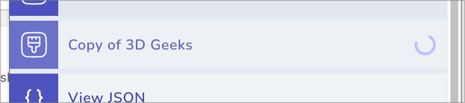

import video from '../../assets/screenshots/theme-search.mp4'

### Fixed

- Storefront component will now output the correct admin URLs
- Storefront component should now fully work on Shopify CLI-hosted stores

### Added

- Admin component will now mark themes that are still processing.

- Added Fuse.js search
  - Search by theme name, ID, and role.
  - Search results are weighted, with ID and role given a higher weight.

<video src={video} controls loop muted />